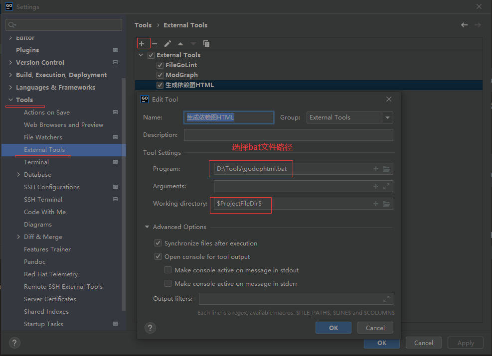
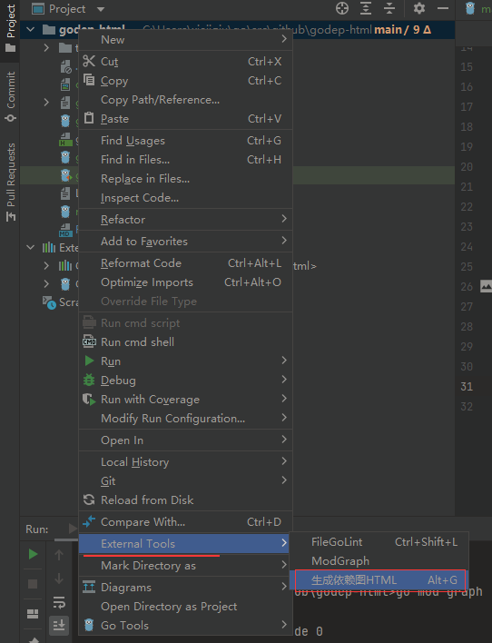
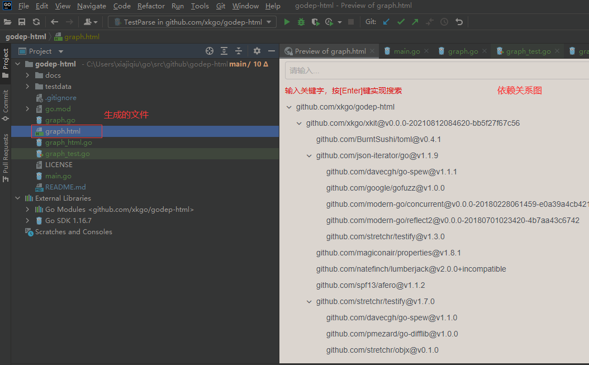

# godep-html
Generate go mod graph html

# 使用说明
## 安装
```shell
go install github.com/xkgo/godep-html
```

安装后在 $GOPATH/bin 目录下面就有 <code>godep-html</code> 可执行文件

## 生成依赖 HTML
```shell
# 打开项目目录，然后执行
go mod graph | godep-html > graph.html
```

## 集成到GoLand
1. 编写 <code>godephtml.bat</code>, 内容如下：
```shell
go mod graph | godep-html > graph.html
```

2. 配置GoLand的 External Tools



PS：你可以配置快捷键来生成

3. 生成 <code>graph.html</code>



4. 效果

